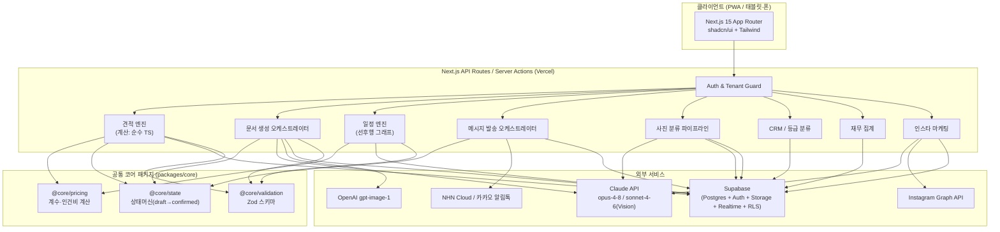
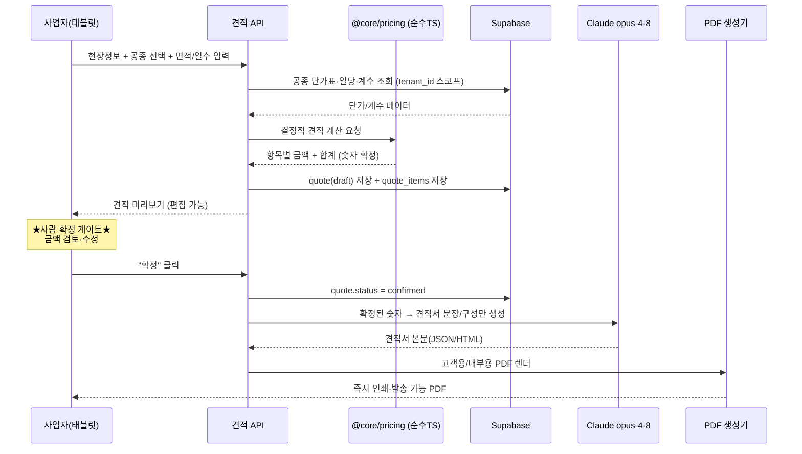
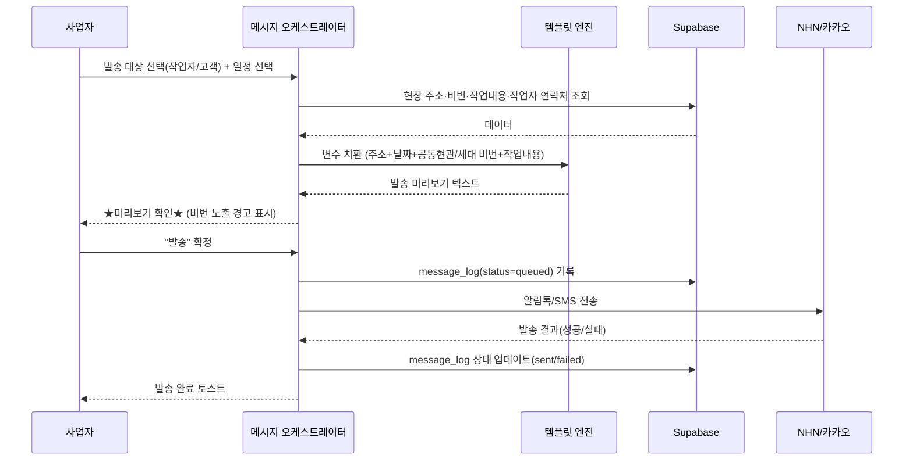
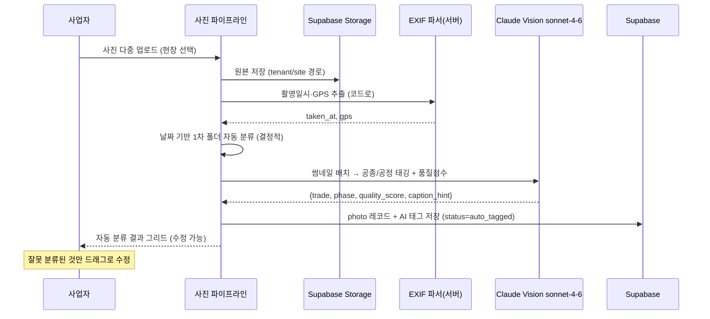
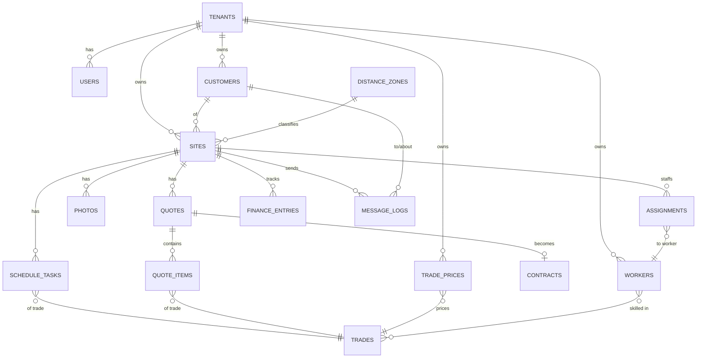
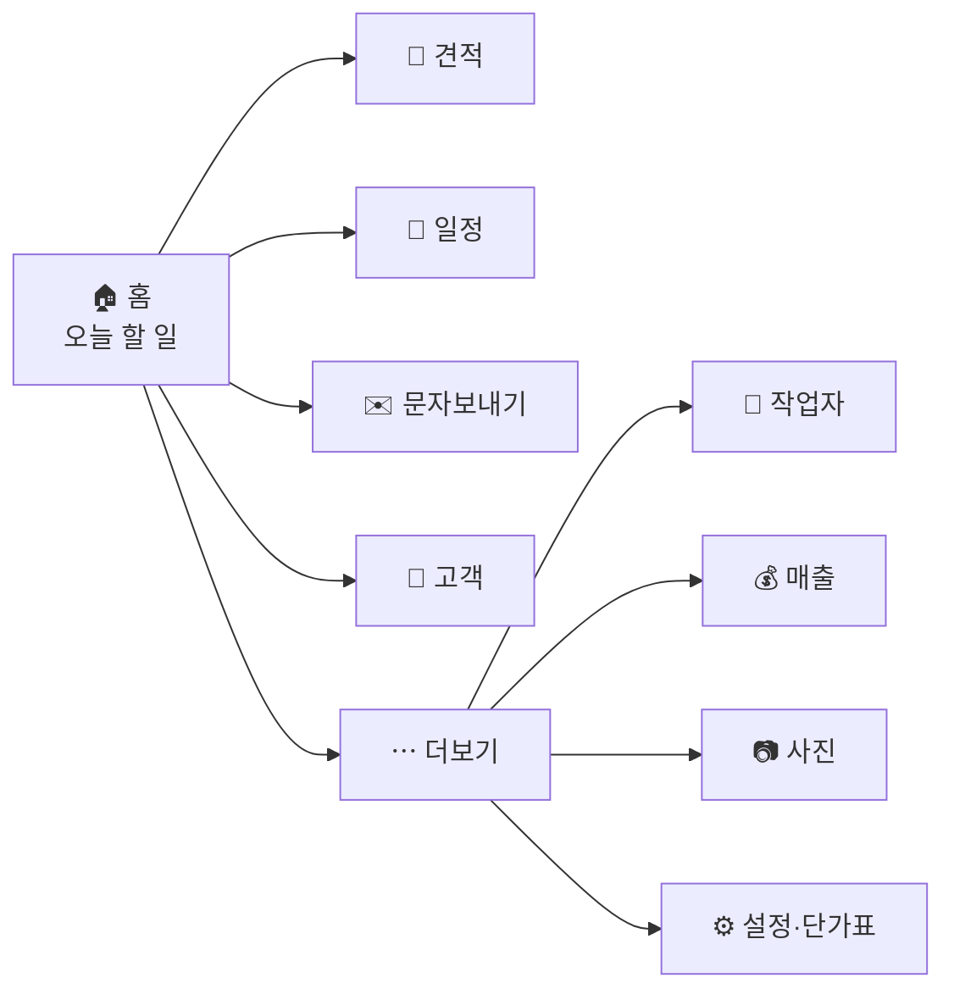
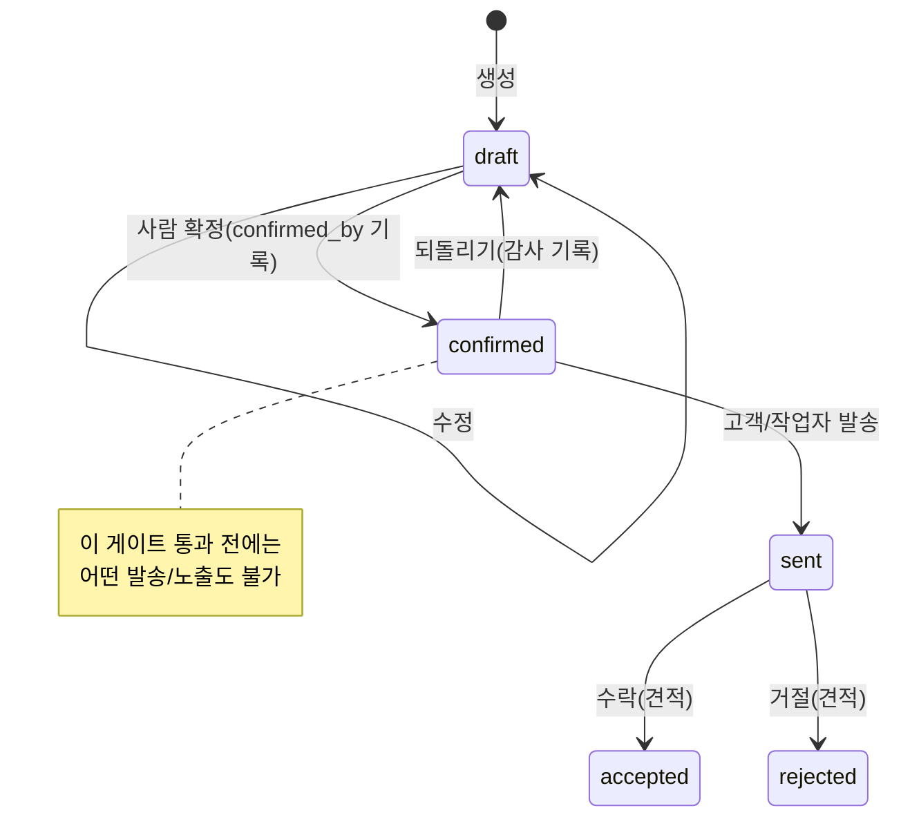

# 인테리어 AI 통합 업무 자동화 플랫폼 — 기술 설계 문서

> 코드네임: **InteriorOS** (가칭)
> 대상: 인테리어 자영업 60대 사업자 (1차) → 동종 업계 SaaS (확장)
> 작성 기준일: 2026-06-15
> 핵심 원칙: **"AI는 초안을 만들고, 사람은 확정한다"** + **"태블릿에서 3클릭 안에 끝낸다"**

---

## 목차

1. [전체 시스템 아키텍처](#1-전체-시스템-아키텍처)
2. [DB 스키마 설계](#2-db-스키마-설계)
3. [UX 흐름 설계](#3-ux-흐름-설계)
4. [견적 계수 시스템 설계](#4-견적-계수-시스템-설계)
5. [Claude API 프롬프트 전략](#5-claude-api-프롬프트-전략)
6. [Phase별 개발 로드맵](#6-phase별-개발-로드맵)
7. [리스크 & 해결 방안](#7-리스크--해결-방안)
8. [폴더 구조](#8-폴더-구조)

---

## 0. 설계 철학 (먼저 읽어주세요)

이 시스템에서 가장 중요한 두 가지 위험은 **(1) 금액/날짜 오류로 인한 고객 신뢰 붕괴**와 **(2) IT 비전문가 사용자의 이탈**입니다. 따라서 두 가지를 아키텍처 레벨에서 강제합니다.

- **계산은 코드로, 표현은 AI로**: 금액 합산·일정 계산·자재 수량은 절대 LLM에 맡기지 않고 결정적(deterministic) TypeScript 함수로 계산합니다. Claude는 "이미 확정된 숫자"를 받아 문서/문장으로 표현만 합니다. → 환각으로 인한 금액 오류 원천 차단.
- **사람 확정 게이트(Human-in-the-loop Gate)**: 견적/계약서/문자/인스타 업로드는 모두 `draft → 사람 검토 → confirmed` 상태 머신을 거칩니다. confirmed 없이는 고객에게 어떤 것도 발송/노출되지 않습니다.

---

## 1. 전체 시스템 아키텍처

### 1.1 모듈 구조 및 의존 관계



**핵심 의존 규칙**

- 모든 도메인 모듈은 `packages/core`를 통해서만 계산/검증/상태전이를 수행한다. (모듈 간 직접 import 금지 → SaaS 확장 시 모듈 독립성 유지)
- `@core/pricing`은 **순수 함수**다. DB·LLM·네트워크 접근 없음 → 단위 테스트 100% 가능, 금액 계산의 신뢰성 보장.
- LLM 호출은 항상 `DOC` / `PHOTO` / `INSTA` 오케스트레이터를 거친다. 비용/재시도/캐싱/프롬프트 버전 관리를 한 곳에서.

### 1.2 데이터 흐름

#### (A) 견적 생성 흐름



> **중요**: LLM은 `confirmed` 이후에만 호출되고, 입력으로 받는 숫자는 절대 바꾸지 않는다. 프롬프트에 "숫자는 제공된 값을 그대로 사용, 재계산 금지"를 명시(§5.1).

#### (B) 문자/알림 발송 흐름



> 보안 주의: 세대/공동현관 비번은 민감정보. 발송 로그에는 **마스킹 저장**, 발송 후 N일 경과 메시지 본문 자동 파기(설정 가능).

#### (C) 사진 분류 흐름



### 1.3 API 설계 원칙

- **Server Actions 우선, API Route 보조**: 폼 제출/뮤테이션은 Next.js Server Actions(타입 안전, 진행상태 내장). 외부 웹훅(SMS 결과 콜백, 인스타 OAuth 콜백)·크론·서드파티 연동만 Route Handler(`app/api/.../route.ts`).
- **테넌트 가드 미들웨어**: 모든 서버 진입점에서 `requireTenant()` 호출 → `tenant_id` 컨텍스트 주입. RLS와 이중 방어.
- **결정적 계산 vs 생성형 분리**: `/lib/pricing` 등 계산은 동기 순수 함수. LLM 호출은 모두 `await aiGateway.invoke({task, version, input})` 단일 게이트웨이 경유(비용 로깅·재시도·타임아웃·프롬프트 버전).
- **상태머신 강제**: 견적/계약/메시지/인스타 게시물은 `@core/state`의 허용된 전이만 가능. 잘못된 전이는 컴파일/런타임 모두에서 거부.
- **멱등성**: 발송·결제집계 등 부작용 API는 `idempotency_key` 필수 → 60대 사용자의 더블탭/재시도로 인한 중복 발송 방지.
- **에러는 한국어 사용자 메시지로**: 모든 사용자향 에러는 `{ code, userMessage(ko), devMessage }` 형태. UI는 `userMessage`만 노출.

---

## 2. DB 스키마 설계

### 2.1 멀티테넌트 전략 (tenant_id)

- **전략: 공유 스키마 + `tenant_id` 컬럼 + Supabase RLS** (Pool model). 자영업자 수천 명 규모까지 비용 효율적이고 운영 단순.
- 모든 업무 테이블에 `tenant_id uuid not null` 포함. 인덱스 선두 컬럼은 항상 `tenant_id`.
- RLS 정책: `tenant_id = auth.jwt() ->> 'tenant_id'` (JWT 커스텀 클레임). 앱 코드 버그가 있어도 DB가 테넌트 격리.
- 1차 사용자(아빠) 단계에서도 `tenant_id`를 넣고 시작 → 나중에 마이그레이션 불필요(가장 흔한 SaaS 전환 부채를 처음부터 제거).



### 2.2 핵심 테이블 정의

> 표기: PK=기본키, FK=외래키, 모든 업무 테이블은 `tenant_id`, `created_at`, `updated_at` 공통 포함(아래 정의에서 명시).

#### `tenants` — 테넌트(사업자/업체)
| 컬럼 | 타입 | 설명 |
|---|---|---|
| id (PK) | uuid | 테넌트 ID |
| business_name | text | 상호 |
| owner_name | text | 대표자명 |
| plan | enum('basic','pro','team') | 요금제 |
| logo_url | text | 견적서/문서용 로고 |
| default_settings | jsonb | 기본 계수·예비율 등 테넌트 기본값 |
| created_at / updated_at | timestamptz | |

#### `users` — 로그인 사용자 (Supabase auth.users와 1:1)
| 컬럼 | 타입 | 설명 |
|---|---|---|
| id (PK, FK→auth.users) | uuid | |
| tenant_id (FK) | uuid | |
| role | enum('owner','staff') | 권한 |
| display_name | text | |

#### `customers` — 고객
| 컬럼 | 타입 | 설명 |
|---|---|---|
| id (PK) | uuid | |
| tenant_id (FK) | uuid | |
| name | text | 고객명 |
| phone | text | 연락처(정규화 010-…) |
| address | text | 주소 |
| memo | text | 종이메모 디지털화 내용 |
| grade | enum('vip','gold','normal','dormant') | AI 분류 등급(사람 확정 가능) |
| source | enum('referral','online','repeat','etc') | 유입경로 |
| tags | text[] | 자유 태그 |
| imported_from | text | 'csv_contacts' 등 출처 추적 |

#### `sites` — 현장(프로젝트)
| 컬럼 | 타입 | 설명 |
|---|---|---|
| id (PK) | uuid | |
| tenant_id (FK) | uuid | |
| customer_id (FK) | uuid | |
| name | text | 현장명(예: "○○아파트 33평") |
| address | text | 현장 주소 |
| distance_zone_id (FK) | uuid | 거리 구역 → 거리계수 |
| area_pyeong | numeric | 면적(평) |
| difficulty | enum('easy','normal','hard') | 난이도 계수 |
| main_door_code | text(masked) | 공동현관 비번(암호화/마스킹) |
| unit_door_code | text(masked) | 세대 비번 |
| status | enum('lead','quoting','contracted','in_progress','done','canceled') | |
| start_date / end_date | date | 공사 기간 |

#### `trades` — 공종 마스터(전역 + 테넌트 커스텀)
| 컬럼 | 타입 | 설명 |
|---|---|---|
| id (PK) | uuid | |
| tenant_id (FK, nullable) | uuid | null이면 시스템 기본 공종 |
| code | text | 'flooring','wallpaper','tile'… |
| name_ko | text | '바닥재','도배','타일' |
| unit | enum('pyeong','m2','m','ea','set','day') | 산정 단위 |
| sort_order | int | 표시 순서 |

#### `trade_prices` — 공종별 단가표 (사업자 직접 입력)
| 컬럼 | 타입 | 설명 |
|---|---|---|
| id (PK) | uuid | |
| tenant_id (FK) | uuid | |
| trade_id (FK) | uuid | |
| item_name | text | 세부 자재명(예: '강마루', '실크벽지') |
| material_unit_price | numeric | 자재 단가(단위당) |
| labor_day_rate | numeric | 해당 공종 일당 |
| default_days_per_unit | numeric | 단위당 기준 작업일(인건비 산정용) |
| effective_from | date | 단가 적용 시작일(이력 보존) |
| is_active | boolean | |

#### `quotes` — 견적
| 컬럼 | 타입 | 설명 |
|---|---|---|
| id (PK) | uuid | |
| tenant_id (FK) | uuid | |
| site_id (FK) | uuid | |
| version | int | 견적 버전(재견적 추적) |
| status | enum('draft','confirmed','sent','accepted','rejected') | ★상태머신★ |
| subtotal | numeric | 항목 합계(코드 계산) |
| distance_factor | numeric | 적용 거리계수 스냅샷 |
| difficulty_factor | numeric | 난이도계수 스냅샷 |
| reserve_rate | numeric | 예비일정율(기본 0.20) |
| contingency_rate | numeric | 비상율(기본 0.10) |
| total_amount | numeric | 최종 금액(코드 계산, 확정값) |
| customer_pdf_url | text | 고객용 PDF |
| internal_pdf_url | text | 내부용 PDF |
| confirmed_by (FK→users) | uuid | 확정한 사람(감사) |
| confirmed_at | timestamptz | |

#### `quote_items` — 견적 항목
| 컬럼 | 타입 | 설명 |
|---|---|---|
| id (PK) | uuid | |
| tenant_id (FK) | uuid | |
| quote_id (FK) | uuid | |
| trade_id (FK) | uuid | |
| description | text | 항목 설명 |
| quantity | numeric | 수량(면적 등) |
| unit | text | 단위 |
| material_cost | numeric | 자재비(코드 계산) |
| labor_days | numeric | 작업 일수 |
| labor_cost | numeric | 인건비 = labor_days × 일당 |
| line_total | numeric | material_cost + labor_cost |

#### `contracts` — 계약서
| 컬럼 | 타입 | 설명 |
|---|---|---|
| id (PK) | uuid | |
| tenant_id (FK) | uuid | |
| quote_id (FK) | uuid | 근거 견적 |
| site_id (FK) | uuid | |
| status | enum('draft','confirmed','signed') | |
| special_terms | text | 특약사항 |
| payment_terms | jsonb | 계약금/중도금/잔금 비율·일정 |
| pdf_url | text | |
| confirmed_by / confirmed_at | | 사람 확정 게이트 |

#### `schedule_tasks` — 공사 일정(공종별 작업)
| 컬럼 | 타입 | 설명 |
|---|---|---|
| id (PK) | uuid | |
| tenant_id (FK) | uuid | |
| site_id (FK) | uuid | |
| trade_id (FK) | uuid | |
| title | text | |
| start_date / end_date | date | 자동 산정 후 수정 가능 |
| duration_days | numeric | 소요일 |
| depends_on | uuid[] | 선행 작업 ID(선후행 그래프) |
| kind | enum('work','reserve','contingency') | 예비/비상 구분 |
| assignment_id (FK) | uuid | 배정된 작업자 |
| status | enum('planned','active','done','canceled') | |

#### `workers` — 작업자/업체
| 컬럼 | 타입 | 설명 |
|---|---|---|
| id (PK) | uuid | |
| tenant_id (FK) | uuid | |
| name | text | |
| phone | text | |
| company | text | 소속 업체(있으면) |
| rating | numeric(2,1) | 평점 0~5 |
| memo | text | 이력/특이사항 |
| is_active | boolean | |

#### `worker_trades` — 작업자↔공종 (다대다 + 일당)
| 컬럼 | 타입 | 설명 |
|---|---|---|
| worker_id (FK) | uuid | |
| trade_id (FK) | uuid | |
| day_rate | numeric | 이 작업자 기준 일당(있으면 우선) |
| (PK = worker_id+trade_id) | | |

#### `assignments` — 현장 배정
| 컬럼 | 타입 | 설명 |
|---|---|---|
| id (PK) | uuid | |
| tenant_id (FK) | uuid | |
| site_id (FK) | uuid | |
| worker_id (FK) | uuid | |
| trade_id (FK) | uuid | |
| start_date / end_date | date | |
| status | enum('proposed','confirmed','declined','done') | 작업자 회신 추적 |
| notified_at | timestamptz | 예약 문자 발송 시각 |

#### `finance_entries` — 재무 입출금
| 컬럼 | 타입 | 설명 |
|---|---|---|
| id (PK) | uuid | |
| tenant_id (FK) | uuid | |
| site_id (FK) | uuid | |
| direction | enum('in','out') | 수입/지출 |
| category | enum('customer_payment','material','labor','outsourcing','etc') | |
| counterparty | text | 거래처(업체/업자명) |
| worker_id (FK, nullable) | uuid | 지출 대상 작업자 |
| amount | numeric | |
| paid_at | date | |
| memo | text | |

#### `photos` — 현장 사진
| 컬럼 | 타입 | 설명 |
|---|---|---|
| id (PK) | uuid | |
| tenant_id (FK) | uuid | |
| site_id (FK) | uuid | |
| storage_path | text | Supabase Storage 경로 |
| taken_at | timestamptz | EXIF 촬영일시(코드 추출) |
| gps | jsonb | EXIF GPS(있으면) |
| trade_id (FK, nullable) | uuid | AI 태깅 공종 |
| phase | enum('before','progress','after') | AI 추정 공정 |
| quality_score | numeric | Vision 품질점수(인스타 선별용) |
| ai_tags | jsonb | 원본 Vision 결과 |
| status | enum('uploaded','auto_tagged','reviewed') | |

#### `message_logs` — 문자/알림 발송 로그
| 컬럼 | 타입 | 설명 |
|---|---|---|
| id (PK) | uuid | |
| tenant_id (FK) | uuid | |
| target_type | enum('customer','worker') | |
| target_id | uuid | |
| site_id (FK, nullable) | uuid | |
| channel | enum('alimtalk','sms') | |
| template_code | text | |
| body_masked | text | 비번 마스킹된 본문 |
| status | enum('queued','sent','failed') | |
| provider_msg_id | text | 공급자 메시지 ID |
| idempotency_key | text(unique) | 중복발송 방지 |
| sent_at | timestamptz | |

#### `distance_zones` — 거리 구역 → 거리계수
| 컬럼 | 타입 | 설명 |
|---|---|---|
| id (PK) | uuid | |
| tenant_id (FK) | uuid | |
| name | text | '시내','근교','원거리','도서산간' |
| distance_factor | numeric | 1.00 / 1.05 / 1.15 / 1.30 |

#### 보조 테이블 (요약)
- `material_formulas` — 자재 산출 공식(공종·단위·산출식 jsonb). Phase 3.
- `instagram_posts` — 게시물 상태머신(draft/confirmed/published), 선별 사진 FK, 캡션.
- `ai_invocations` — 모든 LLM 호출 로그(task, model, tokens, cost, latency, prompt_version). 비용/품질 모니터링.
- `audit_logs` — 견적/계약/발송 확정 이벤트 감사 추적.

### 2.3 인덱싱 & RLS 핵심
- 모든 조회 패턴 인덱스 선두 = `tenant_id`. 예: `idx_quotes_tenant_site (tenant_id, site_id)`, `idx_photos_tenant_site_taken (tenant_id, site_id, taken_at)`.
- RLS: 각 테이블 `enable row level security` + `policy using (tenant_id = current_tenant())`. `current_tenant()`는 JWT 클레임 기반 SQL 함수.
- Storage 버킷 정책도 경로 prefix `tenant_id/...` 기준으로 RLS 적용.

---

## 3. UX 흐름 설계

### 3.1 설계 원칙 (60대·태블릿 대응)
- **홈은 "오늘 할 일" 한 화면**: 진행 현장, 오늘 발송할 문자, 확인 대기 견적만 큰 카드로.
- **글자·버튼 크게**: 최소 글자 18px, 주요 버튼 높이 56px+, 터치 타깃 48px+.
- **항상 한국어, 전문용어 금지**: "draft" 대신 "임시저장", "confirm" 대신 "확정하기".
- **3클릭 룰**: 핵심 작업은 홈에서 3번 터치 안에 완료.
- **취소 가능·되돌리기 제공**: 발송/확정 후에도 "방금 작업 취소" 토스트(스누즈 5초).
- **한 화면 한 작업**: 마법사형(다음→다음). 한 화면에 입력 필드 과밀 금지.
- **위험 행동은 색·재확인**: 발송/금액확정 버튼은 강조색 + "정말 보낼까요?" 큰 다이얼로그.

### 3.2 네비게이션 구조



> 하단 탭바 5개 고정: **홈 / 견적 / 일정 / 문자 / 고객**. 나머지는 "더보기". (자주 쓰는 것만 항상 보이게.)

### 3.3 핵심 5개 기능 화면 흐름 (텍스트 와이어프레임)

#### (1) AI 견적 만들기

```
[홈] ──"새 견적 만들기"(큰 파란 버튼)──▶

┌─ 1단계: 누구 집인가요? ─────────────┐
│ 🔍 고객 검색 [____________]         │
│   김영희 (010-1234-…) ▶ 선택        │
│   + 새 고객 추가                     │
│                         [다음 ▶]    │
└─────────────────────────────────────┘

┌─ 2단계: 어떤 집인가요? ─────────────┐
│ 현장 주소 [_______________]         │
│ 평수 [ 33 ] 평                       │
│ 거리: ◉시내 ○근교 ○원거리          │
│ 난이도: ○쉬움 ◉보통 ○어려움        │
│                    [◀이전] [다음 ▶] │
└─────────────────────────────────────┘

┌─ 3단계: 무슨 공사 하나요? ──────────┐
│ ☑ 도배   면적[33]평                  │
│ ☑ 바닥재 면적[33]평  종류[강마루▾]  │
│ ☑ 타일   면적[ 5]평                  │
│ ☐ 페인트  ☐ 목공  ☐ 전기 …          │
│  (체크하면 단가표에서 자동 계산)     │
│                    [◀이전] [계산 ▶] │
└─────────────────────────────────────┘

┌─ 4단계: 견적 확인 (★사람 확정★) ───┐
│ 도배       1,650,000원   ✏️수정      │
│ 바닥재     3,300,000원   ✏️수정      │
│ 타일         800,000원   ✏️수정      │
│ ───────────────────────────         │
│ 소계       5,750,000원               │
│ 거리/난이도 적용  +0원               │
│ 예비(20%)  +1,150,000원              │
│ 비상(10%)   +575,000원              │
│ ━━━━━━━━━━━━━━━━━━━━━            │
│ 합계      7,475,000원  ⚠️큰 글씨    │
│                                      │
│ [금액 다시 볼게요]  [이 금액으로 확정]│
└─────────────────────────────────────┘
        │ 확정 클릭
        ▼
┌─ 5단계: 견적서 완성 ────────────────┐
│ ✅ 고급 견적서가 만들어졌어요         │
│ [📄 고객용 보기]  [🖨 인쇄]          │
│ [📱 고객에게 문자로 보내기]          │
│ [내부용(원가 포함) 보기]             │
└─────────────────────────────────────┘
```

#### (2) 문자 보내기 (작업자 섭외/안내)

```
[홈]──"문자 보내기"──▶
┌─ 누구에게? ──────────────────┐
│ ◉ 작업자(섭외/안내)          │
│ ○ 고객(일정·진행 알림)       │
│            [다음 ▶]          │
└──────────────────────────────┘
┌─ 어느 현장/언제? ────────────┐
│ 현장 [○○아파트 ▾]           │
│ 날짜 [6/20(목) ▾]           │
│ 작업 [타일 ▾]               │
│ 작업자 [박타일(010-…) ▾]    │
│            [미리보기 ▶]      │
└──────────────────────────────┘
┌─ 보낼 내용 미리보기 ─────────┐
│ "박타일님, 6/20(목) ○○아파트│
│  101동 1503호 타일 작업      │
│  부탁드립니다.               │
│  주소: 서울 …                │
│  공동현관 ****  세대 ****    │
│  ⚠️ 비번 포함 — 확인하세요"  │
│  (실제 발송엔 비번 포함)     │
│   [수정]   [📤 보내기]       │
└──────────────────────────────┘
       ▼ "보내기"
   "정말 박타일님에게 보낼까요?" [네/아니오]
       ▼
   ✅ 보냈어요 (5초 안에 취소 가능)
```

#### (3) 공사 일정표 (간트)

```
[홈]──"일정"──▶ 현장 선택 ──▶
┌─ ○○아파트 공사 일정 ────────────────────┐
│      6/17 18 19 20 21 22 23 24 25        │
│ 철거 ▓▓                                  │
│ 전기   ▓▓                                │
│ 목공     ▓▓▓                             │
│ 타일        ▓▓ (전기 끝나야 시작)        │
│ 도배           ▓▓▓                       │
│ 예비              ░░ (자동 +20%)         │
│ ─────────────────────────────────────   │
│ [+ 공종 추가] [막대 끌어서 날짜 변경]    │
│ [고급 일정표 PDF] [고객에게 보내기]      │
└──────────────────────────────────────────┘
```
> 막대 드래그로 날짜 이동, 선행작업 위반 시 자동 경고("타일은 전기 끝난 뒤예요").

#### (4) 고객 CRM

```
[고객]──▶
┌─ 고객 ──────────────[+ 가져오기][+추가]┐
│ 🔍[________]  필터: [전체▾]            │
│ ⭐ 김영희  VIP  공사 3회   ▶          │
│    이철수  일반 공사 1회   ▶          │
│    박민지  휴면 마지막 '21 ▶          │
└────────────────────────────────────────┘
   "가져오기" ▶ 연락처 CSV 업로드 ▶ 미리보기·중복확인 ▶ 저장
   고객 상세 ▶ [메모][견적이력][문자보내기][등급 수정]
```

#### (5) 사진 관리

```
[더보기→사진]──▶ 현장 선택 ──▶
┌─ 사진 올리기 ───────────────┐
│ [📷 사진 여러 장 선택]       │
│ 업로드 중… (촬영날짜로 자동 정리)│
└──────────────────────────────┘
       ▼ 자동 분류 완료
┌─ 자동 분류 결과 ─────────────┐
│ [철거] 12장  [타일] 8장      │
│ [도배] 15장  [완공] 6장      │
│ (잘못된 건 끌어서 옮기기)    │
│ [⭐ 인스타용 추천 보기]      │
└──────────────────────────────┘
```

---

## 4. 견적 계수 시스템 설계

> 모든 숫자는 **테넌트 기본값(seed)**이며 사업자가 단가표 화면에서 수정한다. (인테리어 공개 API 없음 → 직접 입력 전제)

### 4.1 공종별 가격표 기본 시드 (예시 10종+)

| 공종(code) | 단위 | 자재 단가(기본) | 일당(기본) | 단위당 기준작업일 |
|---|---|---|---|---|
| 도배 wallpaper | 평 | 30,000원/평 | 250,000원 | 0.12 |
| 바닥재(강마루) flooring | 평 | 70,000원/평 | 280,000원 | 0.10 |
| 타일 tile | 평 | 90,000원/평 | 300,000원 | 0.25 |
| 페인트 paint | 평 | 25,000원/평 | 230,000원 | 0.10 |
| 목공 carpentry | 일 | (별도산정) | 320,000원 | 1.0(일 단위) |
| 전기 electric | 일 | (별도산정) | 300,000원 | 1.0 |
| 설비 plumbing | 일 | (별도산정) | 320,000원 | 1.0 |
| 필름 film | 평/㎡ | 40,000원/㎡ | 280,000원 | 0.08 |
| 철거 demolition | 평 | 15,000원/평 | 250,000원 | 0.08 |
| 욕실(전체) bathroom | set | 2,500,000원/개소 | 350,000원 | 3.0 |
| 주방(싱크) kitchen | set | 1,800,000원/개소 | 300,000원 | 2.0 |
| 창호 window | ea | 350,000원/창 | 300,000원 | 0.3 |

> ⚠️ 위 금액은 **온보딩 시작용 더미값**. 실제 운영 전 사업자가 본인 단가로 덮어쓴다. 시스템은 단가표가 비어 있으면 견적 계산을 막고 "단가를 먼저 입력하세요"로 유도.

### 4.2 거리 계수 / 난이도 계수 기본 테이블

| 거리 구역 | 거리계수 |
|---|---|
| 시내(동일 시·구) | 1.00 |
| 근교 | 1.05 |
| 원거리 | 1.15 |
| 도서·산간 | 1.30 |

| 난이도 | 난이도계수 | 적용 예 |
|---|---|---|
| 쉬움 | 1.00 | 빈집, 자재반입 쉬움 |
| 보통 | 1.10 | 거주 중, 일반 |
| 어려움 | 1.25 | 고층/엘리베이터 없음/협소 |

| 추가 가산 | 율 | 적용 |
|---|---|---|
| 예비 일정 | +20% | 항상(설정 변경 가능) |
| 비상(돌발) | +10% | 항상(설정 변경 가능) |

### 4.3 인건비 & 최종 금액 계산 공식

```
[항목별]
material_cost(항목) = quantity × material_unit_price
labor_days(항목)   = quantity × default_days_per_unit   (또는 사용자 직접 입력)
labor_cost(항목)   = labor_days × labor_day_rate
line_total(항목)   = material_cost + labor_cost

[현장 합산]
subtotal = Σ line_total(모든 항목)

[계수 적용 — 곱셈은 한 번에]
adjusted = subtotal × distance_factor × difficulty_factor

[가산]
reserve      = adjusted × reserve_rate        (기본 0.20)
contingency  = adjusted × contingency_rate    (기본 0.10)

total_amount = round( adjusted + reserve + contingency )   // 원 단위 반올림
```

**예시 계산** (도배+바닥+타일, §3.3 4단계 화면 기준)
```
subtotal = 1,650,000 + 3,300,000 + 800,000 = 5,750,000
시내(1.00)·보통(1.10) → adjusted = 5,750,000 × 1.00 × 1.10 = 6,325,000
reserve(20%)     = 1,265,000
contingency(10%) = 632,500
total = 6,325,000 + 1,265,000 + 632,500 = 8,222,500원
```
> 화면 예시(7,475,000)는 난이도 1.00 가정값으로, 실제 계수에 따라 달라짐을 보여주기 위함. **계산은 `@core/pricing`의 단일 함수가 책임지고, 모든 계수/율은 견적에 스냅샷 저장**(단가표가 나중에 바뀌어도 과거 견적 불변).

```ts
// packages/core/pricing/calcQuote.ts (시그니처 예)
export function calcQuote(input: {
  items: { quantity: number; materialUnitPrice: number; daysPerUnit: number; dayRate: number }[];
  distanceFactor: number; difficultyFactor: number;
  reserveRate: number; contingencyRate: number;
}): { items: LineResult[]; subtotal: number; adjusted: number;
      reserve: number; contingency: number; total: number } { /* 순수 함수, 부작용 없음 */ }
```

---

## 5. Claude API 프롬프트 전략

> 공통 원칙: **(a) 숫자 재계산 금지** — 모든 금액/날짜는 입력으로 주어지며 LLM은 그대로 인용. **(b) 구조화 출력** — `tool_use`(JSON 스키마) 강제로 파싱 안정성 확보. **(c) 프롬프트 버전 관리** — `ai_invocations.prompt_version` 기록. **(d) 한국어 비즈니스 톤**.

### 5.1 견적서 생성 (claude-opus-4-8)

**System Prompt 구조**
```
역할: 당신은 20년 경력 인테리어 견적 문서 전문가다. 신뢰감 있고 고급스러운
      한국어 견적서 본문을 작성한다.

[절대 규칙]
- 제공된 금액·수량·날짜를 절대 변경/재계산하지 마라. 그대로 인용만 한다.
- 합계를 다시 더하지 마라. total_amount 값을 그대로 쓴다.
- 없는 항목·할인·프로모션을 지어내지 마라.

[출력 형식] (tool_use: render_quote 스키마)
- summary: 1~2문장 인사/제안 요지
- scope_description: 공사 범위 서술(항목 나열, 금액은 표로)
- terms: 유효기간·부가세 별도 여부 등 (입력값 기반)
- closing: 신뢰감 있는 마무리 문구

[출력 변형] customer | internal
- customer: 원가/마진/일당 등 내부정보 절대 노출 금지
- internal: 항목별 원가·마진율 포함
```

**User Message(입력 데이터)**: 확정된 `quote` + `quote_items` + 테넌트 상호/로고 + `audience: customer|internal` JSON.
**후처리**: 반환 JSON → `@react-pdf/renderer` 템플릿에 바인딩. 금액 셀은 LLM 텍스트가 아니라 **DB 숫자를 직접 렌더**(이중 안전장치).

### 5.2 계약서 생성 (claude-opus-4-8)

**System Prompt 구조**
```
역할: 인테리어 표준 도급계약서 작성 보조자.

[절대 규칙]
- 고객명/주소/총금액/일정/대금 분할은 입력값을 그대로 삽입.
- 법적 효력에 대한 단정/보증 금지. 표준 조항 + 사업자가 넣은 특약만 반영.
- 분쟁/하자담보 조항은 일반적·중립적 표현으로.

[출력] (tool_use: render_contract)
- preamble: 당사자·현장 명시 (입력값)
- articles[]: 조항 제목+본문 (공사범위/대금/지급일정/공기/하자/특약/해지)
- payment_table: 계약금·중도금·잔금 (입력 비율·금액 그대로)
- signature_block: 서명란 구조
```
> ⚠️ UI에 "법률 자문 아님, 최종 책임은 사업자" 고지. 계약서도 **confirmed 게이트** 필수.

### 5.3 사진 분류 Vision (claude-sonnet-4-6)

**System Prompt 구조**
```
역할: 인테리어 현장 사진 분류 전문가.
입력: 현장 사진 1장(또는 배치). 가능 공종 목록과 코드가 함께 주어진다.

[작업]
1) 어떤 공종(trade)인지 분류 — 제공된 코드 중 택1, 모르면 "unknown"
2) 공정 단계 추정 — before|progress|after
3) 사진 품질 점수 0~100 (구도·선명도·조명; 인스타 게시 적합도)
4) 인스타 캡션 힌트 1줄(한국어) — 과장/허위 금지

[절대 규칙]
- 목록에 없는 공종 코드를 만들지 마라.
- 확신 없으면 confidence를 낮게. 추측을 사실처럼 쓰지 마라.

[출력] (tool_use: tag_photo)
{ trade_code, phase, quality_score, confidence, caption_hint }
```
> 날짜·폴더 1차 분류는 **EXIF 코드**가 담당(LLM 아님). Vision은 내용 태깅·품질평가만 → 비용·오류 최소화. `confidence < 0.6`은 "확인 필요"로 표시해 사람 검수 유도.

### 5.4 AI 게이트웨이 공통 규칙
- 모든 호출: 타임아웃 30s, 지수백오프 재시도 2회, 실패 시 사용자에게 "잠시 후 다시" + draft 보존.
- 배치(사진 다량)는 동시성 제한(rate limit 보호) + 진행률 표시.
- 비용 절감: 정적 프롬프트 부분 캐싱, Vision은 썸네일(긴 변 1024px) 전송.

---

## 6. Phase별 개발 로드맵

### Phase 1 — MVP (견적 + 문서 + 일정 + 문자) · 약 8~10주
**목표**: 아빠가 실제 한 건의 견적→계약→일정→작업자 문자까지 이 앱으로 끝낼 수 있다.

**완료 기준**: 종이 없이 견적서·계약서·일정표 PDF 출력 + 작업자/고객 문자 발송이 실서비스로 동작.

**Phase 1 상세 체크리스트**
- [ ] 프로젝트 셋업: Turborepo, Next.js 15, Tailwind, shadcn/ui, PWA 설정
- [ ] Supabase 연동: Auth, DB, Storage, RLS 기본 정책, `tenant_id` 전 테이블 적용
- [ ] DB 마이그레이션: tenants/users/customers/sites/trades/trade_prices/quotes/quote_items/contracts/schedule_tasks/workers/message_logs/distance_zones
- [ ] 단가표 시드 + 단가표 편집 UI(공종별 자재단가·일당·기준작업일)
- [ ] `@core/pricing` 순수 함수 + 단위 테스트(예시 케이스 일치 검증)
- [ ] `@core/state` 상태머신(draft→confirmed→sent) + 잘못된 전이 차단 테스트
- [ ] 견적 마법사 UI(5단계) + 사람 확정 게이트 + 항목 수동 수정
- [ ] 견적서 PDF(고객용/내부용) — @react-pdf/renderer 템플릿, 로고/상호 반영
- [ ] Claude opus-4-8 견적서 본문 생성(tool_use, 숫자 인용 검증)
- [ ] 계약서 생성 + 확정 게이트 + PDF + 법적 고지
- [ ] 일정 엔진: 공종 소요일 자동 산정 + 선후행 + 예비/비상 자동 추가
- [ ] 간트차트 UI(드래그 수정, 선행 위반 경고) + 일정표 PDF
- [ ] 문자 발송: NHN Cloud SMS or 카카오 알림톡 연동(둘 중 빠른 승인 우선)
- [ ] 문자 템플릿(작업자: 주소+날짜+비번+작업내용 / 고객: 일정·진행) + 미리보기 + 멱등성 + 비번 마스킹 로그
- [ ] AI 게이트웨이(재시도/타임아웃/비용로깅 `ai_invocations`)
- [ ] 홈 "오늘 할 일" 대시보드
- [ ] PWA 설치 가이드(태블릿 홈 화면 추가), 대형 폰트/버튼 접근성 점검
- [ ] 실사용 온보딩: 단가표 입력 마법사

### Phase 2 — 운영 도구 (CRM·작업자·재무·사진) · 약 6~8주
**목표**: 흩어진 데이터를 한곳에 모으고 운영을 자동화.
**완료 기준**: 연락처 CSV 수백 건 가져오기, 현장별 마진 확인, 사진 자동 분류가 동작.
- [ ] 고객 CRM + 연락처 CSV 가져오기(중복 병합 UI) + 메모 디지털화
- [ ] AI 우수고객 등급 분류(공사 횟수/매출/최근성 기반, 사람 확정) + 주기 인사 문자 스케줄
- [ ] 작업자/업체 DB + 공종·평점·이력 + 가용일정·배정 + 예약 문자 자동
- [ ] 재무: 현장별/업체별 입출금 집계, 마진율, 월·연 대시보드
- [ ] AI 사진 관리: 업로드→EXIF 날짜 분류→Claude Vision 태깅 원클릭 + 수동 보정

### Phase 3 — 성장 기능 (인스타·자재산출·무드보드) · 약 6주
**목표**: 마케팅·정밀화로 매출 기여.
**완료 기준**: 인스타 자동 게시(확정 게이트), 면적→자재수량, 무드보드 생성.
- [ ] 인스타: Vision 사진 선별 → 캡션 생성 → Graph API 게시(비즈계정·확정 후 게시)
- [ ] 자재 수량 산출: 공식 테이블 입력 + 면적→수량 계산
- [ ] 3D 무드보드: gpt-image-1, "참고용" 워터마크/고지 강제

### Phase 4 — SaaS 전환 · 약 6~8주
**목표**: 다수 사업자 셀프 온보딩 판매.
**완료 기준**: 신규 사업자가 결제→온보딩→첫 견적까지 자력 완료.
- [ ] 멀티테넌트 본격화(가입 플로우, 테넌트 프로비저닝, RLS 부하·격리 검증)
- [ ] 요금제(basic/pro/team) + 결제(토스페이먼츠/스트라이프) + 기능 게이팅
- [ ] 온보딩 마법사(단가표 가이드·데이터 가져오기) + 도움말/튜토리얼
- [ ] 사용량·비용 모니터링(테넌트별 AI 비용), 관리자 콘솔

---

## 7. 리스크 & 해결 방안

### 7.1 기존 데이터 디지털화 전략
- **연락처**: 폰 연락처 → CSV/vCard 내보내기 → 업로드 → 컬럼 매핑 마법사 → 중복 자동 감지(전화번호 정규화) → 미리보기 후 일괄 등록.
- **종이 메모**: 사진 촬영 → (Phase 2) Vision으로 텍스트 초안 추출 → 사람 검수 후 고객 메모로 저장. 무리하게 자동화하지 않고 "고객별 메모 빠른 입력" UI 우선 제공.
- **점진적 이전**: 한 번에 다 옮기지 않는다. "새 견적 만들 때 그 고객만 등록"하는 자연 이전 경로 + 빈 검색 시 "새 고객 추가" 항상 노출.
- **출처 추적**: `imported_from`으로 가져온 데이터 구분 → 정리 우선순위 파악.

### 7.2 AI 금액 실수 방지 설계 (다층 방어)
1. **계산 분리**: 금액/일정/수량은 LLM이 아닌 `@core/pricing` 순수 함수가 계산. LLM은 확정 숫자를 표현만.
2. **숫자 인용 강제**: 프롬프트에 "재계산 금지", 출력 검증 단계에서 LLM 본문 내 합계와 DB total_amount 불일치 시 LLM 텍스트 무시하고 DB 값으로 렌더.
3. **사람 확정 게이트**: draft→confirmed 없이는 고객 노출/발송 불가. 확정자·시각 감사 기록(`confirmed_by/at`).
4. **PDF는 DB 숫자 직접 렌더**: 금액 표 셀은 LLM 텍스트가 아니라 DB 값 바인딩.
5. **스냅샷**: 견적에 계수·율·단가 스냅샷 저장 → 단가표 변경이 과거 견적 금액을 바꾸지 못함.
6. **멱등성·되돌리기**: 더블탭 중복 발송 방지, 발송 직후 짧은 취소 창.
7. **날짜 일관성 검증**: 일정 선후행 위반·과거 날짜 자동 경고.

### 7.3 SaaS 경쟁사 분석 & 차별화

| 구분 | 일반 ERP/견적 SW | 범용 노션/엑셀 템플릿 | **InteriorOS** |
|---|---|---|---|
| 대상 | 중대형 업체 | 만능이지만 직접 구성 | **인테리어 1인·소형 자영업** |
| 진입장벽 | 높음(교육 필요) | 중(직접 설계) | **낮음(3클릭, 60대 타깃 UX)** |
| 견적 | 수식 직접 작성 | 수식 직접 | **공종 계수 내장 + 직접 단가** |
| 문서 | 정형 양식 | 직접 디자인 | **AI 고급 견적/계약서 자동** |
| 사진/마케팅 | 없음 | 없음 | **Vision 분류 + 인스타 자동** |
| 비용오류 | 사람 책임 | 사람 책임 | **계산분리+확정게이트 설계** |

**차별화 핵심 3가지**
1. **업종 특화 + 초간단 UX**: 범용 도구가 못 따라오는 "인테리어 자영업자 워크플로우" 그대로 + 60대도 쓰는 단순함.
2. **AI 문서 품질**: 경쟁사 대비 즉시 인쇄 가능한 고급 견적/계약/일정 문서 → 영업 현장에서 신뢰감으로 직결.
3. **신뢰 안전장치**: "AI가 멋대로 금액을 못 바꾸는" 설계를 마케팅 포인트로(자영업자의 가장 큰 두려움 해소).

**주요 리스크 & 완화**
- 알림톡/인스타/결제 외부 API 정책·승인 지연 → Phase 1은 SMS 우선, 인스타는 Phase 3로 분리.
- LLM 비용 증가 → 게이트웨이 비용 로깅, Vision 썸네일, 캐싱, 요금제로 전가.
- 무드보드 정밀도 오해 → "참고용" 워터마크·고지 강제.
- 단가표 미입력 상태 견적 → 계산 차단 + 온보딩 강제.

---

## 8. 폴더 구조 (Turborepo + Next.js 15 App Router)

```
interior-ai/
├─ turbo.json
├─ package.json
├─ pnpm-workspace.yaml
├─ .env.example
├─ PLAN.md
│
├─ apps/
│  └─ web/                          # Next.js 15 App Router (PWA)
│     ├─ next.config.ts
│     ├─ public/
│     │  ├─ manifest.webmanifest    # PWA
│     │  └─ icons/
│     ├─ src/
│     │  ├─ app/
│     │  │  ├─ (auth)/
│     │  │  │  ├─ login/page.tsx
│     │  │  │  └─ onboarding/page.tsx        # 단가표 입력 마법사
│     │  │  ├─ (app)/
│     │  │  │  ├─ layout.tsx                 # 하단 탭바(홈/견적/일정/문자/고객)
│     │  │  │  ├─ page.tsx                   # 홈: 오늘 할 일
│     │  │  │  ├─ quotes/
│     │  │  │  │  ├─ page.tsx                # 견적 목록
│     │  │  │  │  ├─ new/page.tsx            # 견적 마법사
│     │  │  │  │  └─ [id]/page.tsx           # 견적 상세/확정/PDF
│     │  │  │  ├─ contracts/[id]/page.tsx
│     │  │  │  ├─ schedule/[siteId]/page.tsx # 간트차트
│     │  │  │  ├─ messages/page.tsx          # 문자 보내기
│     │  │  │  ├─ customers/
│     │  │  │  │  ├─ page.tsx
│     │  │  │  │  ├─ import/page.tsx         # CSV 가져오기
│     │  │  │  │  └─ [id]/page.tsx
│     │  │  │  ├─ workers/...
│     │  │  │  ├─ finance/page.tsx
│     │  │  │  ├─ photos/[siteId]/page.tsx
│     │  │  │  └─ settings/
│     │  │  │     ├─ prices/page.tsx         # 단가표 편집
│     │  │  │     └─ factors/page.tsx        # 거리/난이도 계수
│     │  │  ├─ api/                          # Route Handlers(웹훅/크론만)
│     │  │  │  ├─ webhooks/sms/route.ts      # 발송 결과 콜백
│     │  │  │  ├─ webhooks/instagram/route.ts
│     │  │  │  └─ cron/customer-greetings/route.ts
│     │  │  ├─ layout.tsx
│     │  │  └─ globals.css
│     │  ├─ actions/                         # Server Actions(뮤테이션)
│     │  │  ├─ quotes.ts
│     │  │  ├─ contracts.ts
│     │  │  ├─ schedule.ts
│     │  │  ├─ messages.ts
│     │  │  ├─ customers.ts
│     │  │  └─ photos.ts
│     │  ├─ components/                      # UI(shadcn 기반)
│     │  │  ├─ ui/                           # shadcn 컴포넌트
│     │  │  ├─ quote/QuoteWizard.tsx
│     │  │  ├─ schedule/GanttChart.tsx
│     │  │  ├─ messages/MessagePreview.tsx
│     │  │  └─ common/BigButton.tsx          # 60대용 대형 버튼
│     │  ├─ lib/
│     │  │  ├─ supabase/{client,server}.ts
│     │  │  ├─ auth/requireTenant.ts
│     │  │  ├─ ai/gateway.ts                 # AI 단일 게이트웨이
│     │  │  ├─ ai/prompts/{quote,contract,vision}.ts
│     │  │  ├─ pdf/{quote,contract,schedule}.tsx  # react-pdf 템플릿
│     │  │  └─ sms/{nhn,kakao}.ts
│     │  └─ hooks/
│     └─ tsconfig.json
│
├─ packages/
│  ├─ core/                          # 도메인 코어(순수·테스트 가능)
│  │  ├─ src/
│  │  │  ├─ pricing/calcQuote.ts     # ★결정적 견적 계산
│  │  │  ├─ pricing/__tests__/
│  │  │  ├─ schedule/planner.ts      # 선후행·예비/비상 산정
│  │  │  ├─ state/quoteMachine.ts    # 상태머신
│  │  │  └─ validation/schemas.ts    # Zod
│  │  └─ package.json
│  ├─ db/                            # Supabase 타입·마이그레이션
│  │  ├─ migrations/
│  │  ├─ seed/trade_prices.seed.ts
│  │  └─ types.ts                    # supabase gen types
│  ├─ ui/                            # 공유 디자인 토큰/테마
│  └─ config/                        # eslint, tsconfig, tailwind preset
│
└─ docs/
   └─ onboarding-guide.md
```

---

## 부록 A. 상태머신 (견적/문서/메시지 공통 패턴)



## 부록 B. 환경 변수 (.env.example)
```
NEXT_PUBLIC_SUPABASE_URL=
NEXT_PUBLIC_SUPABASE_ANON_KEY=
SUPABASE_SERVICE_ROLE_KEY=
ANTHROPIC_API_KEY=            # claude-opus-4-8 / claude-sonnet-4-6
OPENAI_API_KEY=               # gpt-image-1 (무드보드)
NHN_SMS_APP_KEY=
NHN_SMS_SECRET_KEY=
KAKAO_ALIMTALK_KEY=
INSTAGRAM_GRAPH_TOKEN=
```

## 부록 C. 즉시 실행 권장 순서 (Day 1~)
1. Turborepo + Next.js 15 + Supabase 스캐폴딩, `tenant_id`/RLS 골격.
2. `@core/pricing` + 단위 테스트(§4.3 예시 통과)부터 — 신뢰의 토대.
3. 단가표 입력 UI → 견적 마법사 → 사람 확정 게이트 → PDF.
4. 그다음에야 Claude 본문 생성·문자 발송 연결.

> 한 줄 요약: **계산은 코드가, 표현은 AI가, 확정은 사람이.** 이 원칙 위에서 60대도 3클릭으로 쓰는 인테리어 SaaS를 단계적으로 키운다.
